#### 介绍
学生可以在App端注册，教师发送在线签到，发布作业，并使用websocket 和 JPush 完成的一个简单的crud毕业设计项目，后台管理使用RBAC权限控制划分分配角色。
其中App端封装了一些实用组件：瀑布流，手势绘制。
服务端使用redis实现大文件分片上传，断点续传，秒传
客户端使用WebWorker + spark-md5 实现文件存储的唯一性
本项目还有许多可以完善的，但是用于毕业应该够了。。。

#### 软件架构

本项目分为一个基于Nodejs的Nestjs框架的服务端
一个Vue3后台管理系统
一个RN的App端(仅能运行在Android端)

1、后台管理系统技术栈
Vue3 + pinia + composition Api + TypeScript + WebSocket + element-plus + Axios
2、后端服务
nodejs + nestjs + typeorm + mysql + redis + joi + jpush-async
3、app端
react native >= 0.73.0 + react 18 + react-navigation/native-stack + JPush + redux
#### 安装教程
#   web 管理系统
1.  cd mm_stu_back (建议使用 node v14.18.3 安装依赖)
2.  npm install
3.  npm run serve 或者 直接 运行 run.bat

#   服务端
1. cd mm_stu_serve (建议使用 node v20+)
2. npm install
3. npm run start 或者 直接 运行 run.bat

#   App端
1. cd mm_stu_app
2. npm install
3. npm run start

#### 使用说明

1. 需要在 mm_stu_serve 新建一个 .env 文件
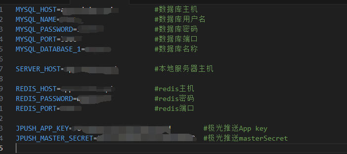

#### 项目展示
1、管理系统 配置菜单
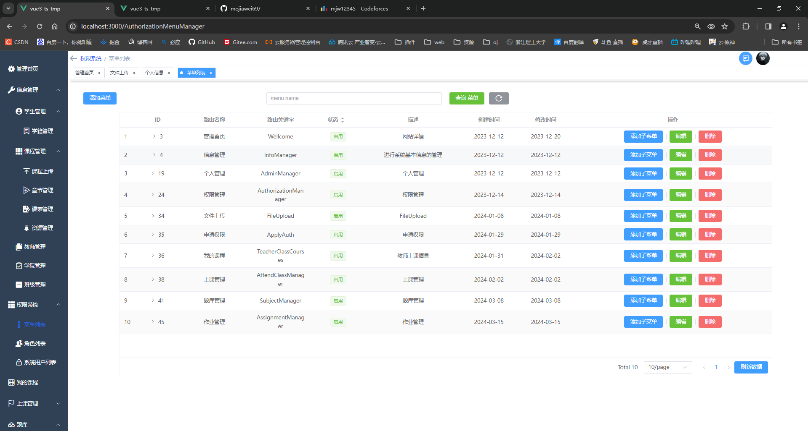
2、分配角色
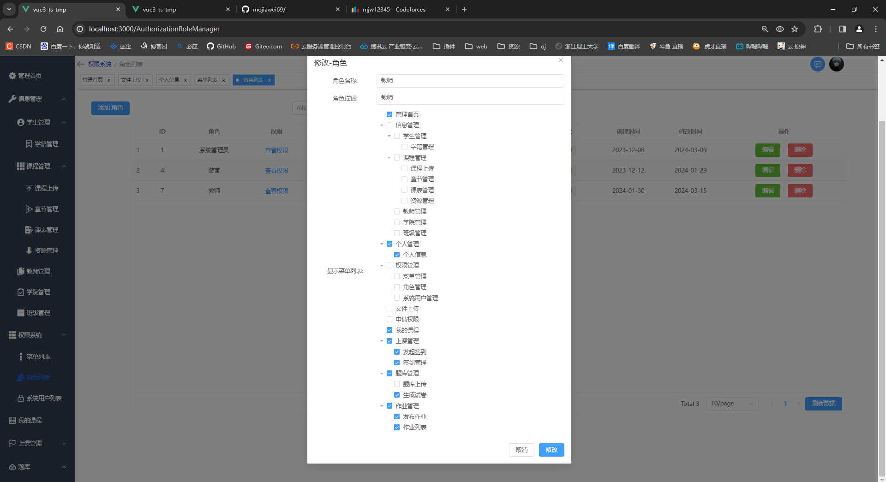
3、上传文件 支持断点续传，秒传
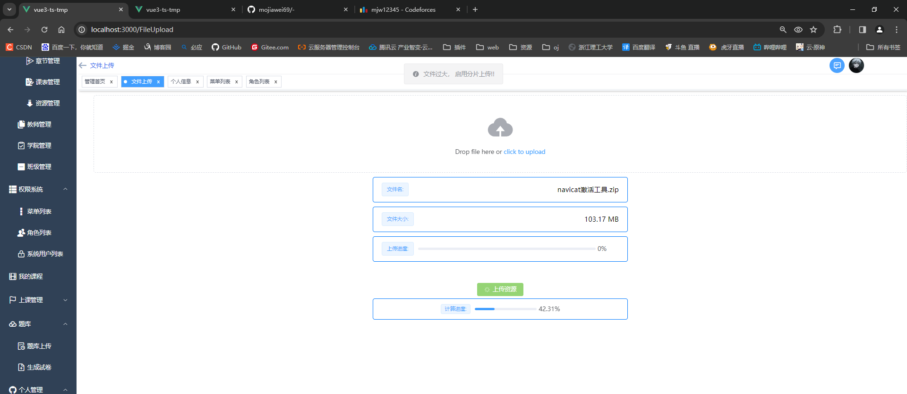
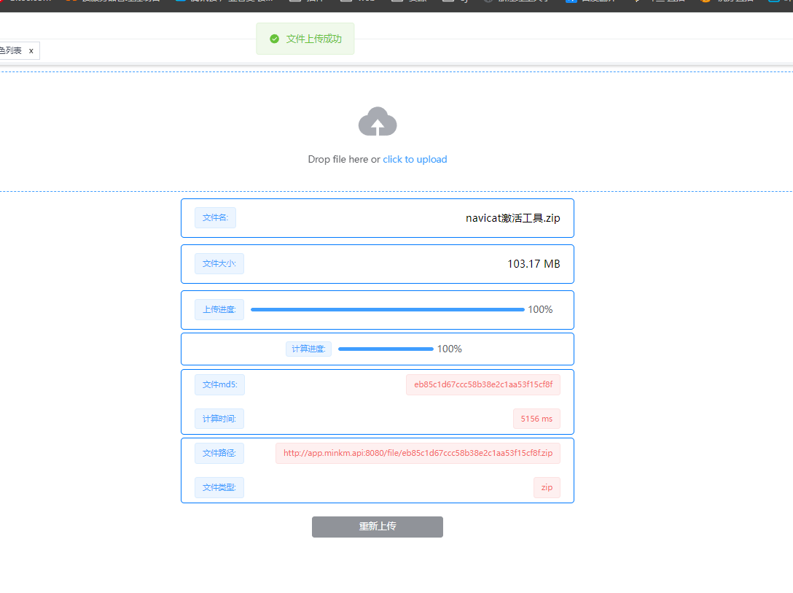
4、教师用户登录
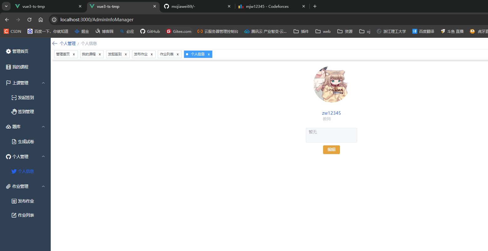
5、教师发布签到
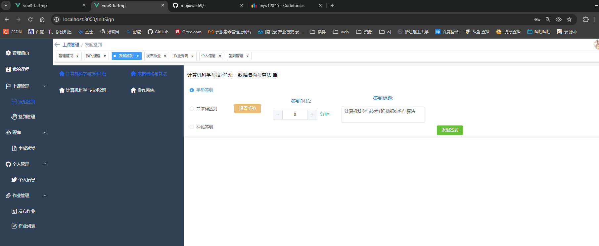
设置手势签到
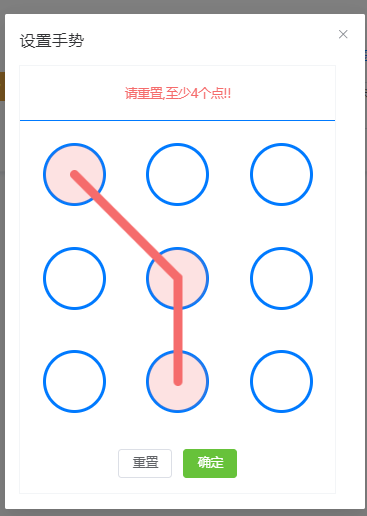
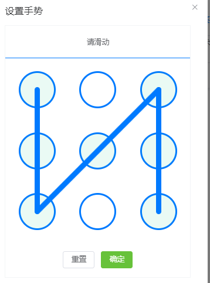
6、教师发布作业 题库由管理员上传
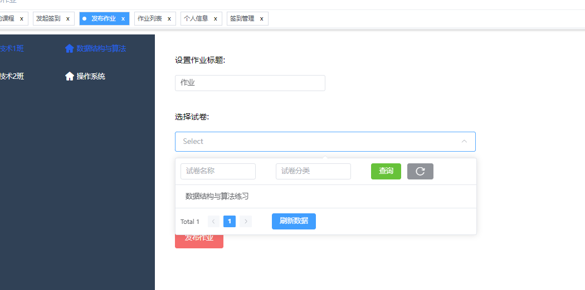
7、app端登录
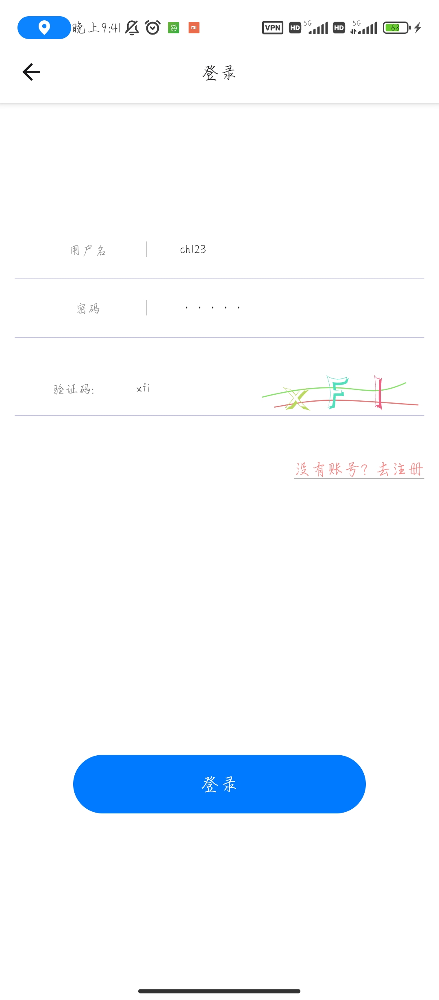
主页面
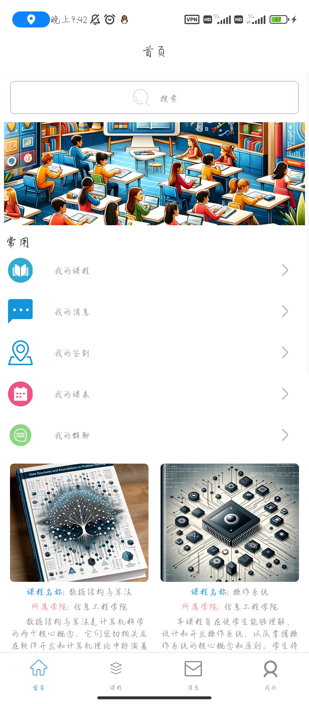
收到签到通知
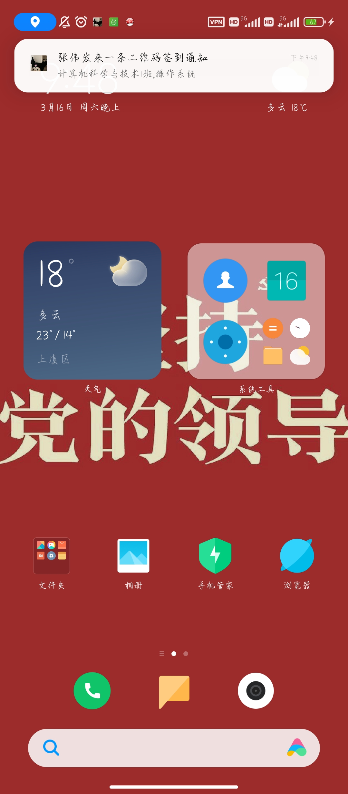
进行签到
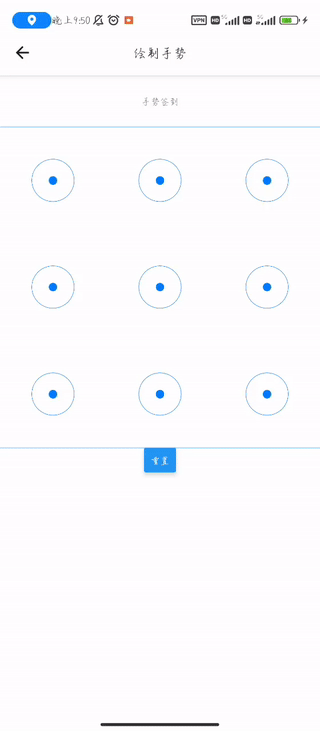
在线测验
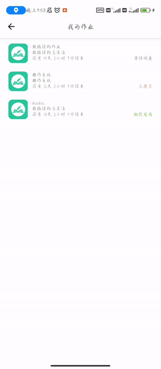

